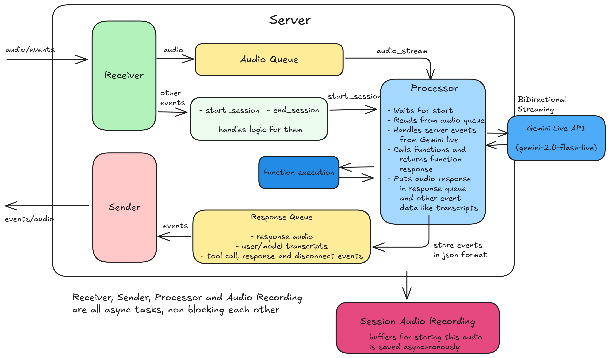

# Gemini Live Voice Agent Server

This folder contains the backend server components for a real-time, bidirectional voice agent using Google Gemini Live API. The server uses WebSockets to stream audio from a client to the Gemini API and stream the model's audio response back to the client, enabling natural, low-latency conversational AI experience.

## Features
- **Real-Time Bidirectional Audio**: Streams audio to and from the client using WebSockets for a live, conversational feel.
- **Google Gemini Live API Integration**: Leverages the power of Google's latest multimodal live API for advanced understanding and response generation.
- **Intelligent Function Calling**: The agent can execute predefined Python functions (tools) to perform actions like scheduling meetings or querying a database, interacting with other systems.
- **Dynamic Tool Schema Generation**: Automatically generates OpenAPI-compliant schemas from standard Python functions, making it easy to add new tools.
- **Asynchronous & Scalable**: Built with `Quart` and `asyncio`, the server is designed to handle multiple concurrent connections efficiently.
- **Session Recording**: Automatically saves the full conversation (user and model audio) as a mixed MP3 file for review and analysis.
- **Robust Connection Handling**: Gracefully manages the lifecycle of each WebSocket connection, including setup, teardown, and error handling.

## High Level Architecture
The server is designed around an asynchronous, event-driven architecture to manage real-time communication efficiently. For each client that connects, a dedicated WebSocketHandler instance is created. This handler orchestrates three concurrent tasks using `asyncio`:
1. **Receiver (_receive_from_client)**: Listens for incoming messages from the client (e.g., audio chunks, session control events). Audio data is placed into an audio_queue.
2. **Processor (_process_gemini_stream)**: Pulls audio data from the audio_queue and streams it to the Gemini Live API. It then listens for responses from Gemini (e.g., transcripts, audio chunks, tool calls) and places the processed results into a response_queue.
3. **Sender (_send_to_client)**: Pulls messages from the response_queue and sends them back to the client over the WebSocket connection.

This **separation of concerns** using queues ensures that the components are decoupled. The I/O-bound operations (receiving from the client, communicating with Gemini, sending to the client) do not block each other, leading to a highly responsive system.

**High Level Architecture and Data Flow**:


## Core Components

### Websocket server (app.py)
This is the main entry point of the application. It uses **Quart**, an asynchronous web framework, to handle WebSocket connections.

`WebSocketHandler` class is the heart of the server, managing the entire lifecycle of a single client connection.
- **__init__(self, ws)**: Initializes essential components for a single session:
    - `audio_queue`: An asyncio.Queue to buffer audio chunks received from the client before they are sent to Gemini.
    - `response_queue`: An asyncio.Queue to buffer responses from Gemini (audio, transcripts, etc.) before they are sent to the client.
    - `session_started_event`: An asyncio.Event to synchronize the start of the Gemini processing stream with a "start" signal from the client. This prevents the server from trying to process audio before the client is ready.
- **_receive_from_client()**: An asynchronous loop that constantly listens for messages from the client.
    - It decodes the incoming JSON messages and routes them based on the event type (`start_session`, `audio_chunk`, `end_session`).
    - This task isolates the logic for handling client input. Placing received audio into a queue decouples the receiver from the processor, allowing the receiver to accept new audio chunks immediately, even if the Gemini API has a delay or encounters any issues.
- **_audio_stream_generator()**: An asynchronous generator that yields audio chunks from the `audio_queue`.
    - The Gemini Live API's `start_stream` method requires an asynchronous iterable as its input. This generator provides a clean and efficient way to feed the audio data from our queue into the API in real-time.
- **_process_gemini_stream()**: This is the core processing task. It connects to the Gemini Live API and starts the bidirectional stream.
    - It waits for the `session_started_event` before proceeding, ensuring the client has explicitly started the session.
    - It iterates through the responses from the Gemini stream, handling different types of server content:
        - **Transcripts**: Sends `user_transcript` and `model_transcript` events to the client.
        - **Audio Chunks**: Receives raw audio bytes from the model, encodes them in Base64, and puts them on the `response_queue` as audio_chunk events.
        - **Tool Calls**: When the model decides to use a tool, this section receives the tool name and arguments, puts a tool_call event on the queue, executes the corresponding Python function via `gemini.call_function()`, and sends the result back to Gemini.
    - This task centralizes all interaction with the Gemini API. By placing all outgoing messages onto the `response_queue`, it decouples API processing from the task of sending data to the client, which is crucial for maintaining responsiveness.
- **_send_to_client()**: A simple loop that pulls messages from the response_queue and sends them to the client in the expected JSON format.
    - This task's sole responsibility is network I/O to the client. This separation prevents any delays in Gemini processing from affecting the sending of already-processed messages.
- **handle_websocket_connection()**: The main method for a connection. It creates and starts the `receiver`, `processor`, and `sender` tasks using `asyncio.create_task`.
    - It includes a pretty good exception handling logic to ensure that if any task fails or the connection closes, all other tasks are cancelled, queues are cleared, and the session recording is saved.
- **_save_recording()**: This function is called at the end of a session. It combines all the user's audio chunks into a single audio track.
    - Uses `pydub` and `ffmpeg` to overlay the audio samples at different rates and of different lengths.
    - It iterates through the model's audio events, which were timestamped during the session, and overlays them onto the user's audio track at the correct positions.
    - **Core Logic**: More detailed explanation can be found here: **[Recording Audio Guide](./Recording_guide.md)**
    - Audio processing with pydub is a CPU-intensive, blocking operation. To avoid freezing the entire server, it is run in a separate thread using `asyncio.to_thread`. This allows the server to remain responsive to other connections while the recording is being saved.

### Gemini Client Wrapper (gemini_live_handler.py)
This module abstracts away the complexities of configuring and interacting with the Google GenAI SDK. It has two main components:
- **_setup_config()**: This is where the Gemini session is configured. You can easily change the language_code, voice_name, system_instruction (the agent's persona and rules), and the tools the model can use.
- **call_function()**: This method acts as a dispatcher. When the Gemini API requests a tool call, this function finds the corresponding Python function in the self.tools list by its name and executes it with the provided arguments. It then formats the result into a FunctionResponse object that the API understands.

### Function Calling Handler (tools.py & utils.py)
These are the modules that allows tool execution and abstracts a lot of things making it easier for developers to customize things and add new tools as required.

- **tools.py**: This is where you define the functions (tools) that you want the LLM to be able to call.
    - Python's Annotated type hints (e.g., `Annotated[str, "The subject..."]`) are used here to automatically extract function declaration schema from function definiton alone. The description string within Annotated provides crucial context that the model uses to understand what the parameter is for.
    - Each function is decorated with `@function_tool`.
- **utils.py**: This file contains the "magic" for the tool system. It's a powerful utility that automatically converts a standard Python function into a detailed, OpenAPI-compliant JSON schema.
    - `FunctionSchemaBuilder`: Uses Python's built-in inspect module to analyze a function's signature, parameters, default values, and type hints. It even unpacks Annotated types and Enum classes to build a rich schema.
    - `@function_tool Decorator`: This is a simple but elegant decorator. When you apply it to a function in tools.py, it runs the FunctionSchemaBuilder, generates the full JSON schema for that function, and attaches it to the function object itself as a `tool_metadata` attribute.
    - This automation is a massive time-saver and reduces errors. Instead of manually writing complex JSON schemas for every function, you just write a normal Python function with clear type hints and docstrings. The utility handles the rest, ensuring the LLM gets a perfect definition of the tool every time.

## Development Guide

### Prerequisites
- Python 3.9+
- A Google AI Studio API Key.

### Setup and Installation

1.  **Clone the repository:**
    ```bash
    git clone https://github.com/Ruthvik-1411/GenAI-Projects
    cd GenAI-Projects/gemini_live_boilerplate/server
    ```

2.  **Create and activate a virtual environment:**
    ```bash
    python -m venv venv
    source venv/bin/activate  # On Windows, use `venv\Scripts\activate`
    ```

3.  **Install the required dependencies:**
    Run:
    ```bash
    pip install -r requirements.txt
    ```
> Additional Installations: ffmpeg https://www.ffmpeg.org/download.html https://www.gyan.dev/ffmpeg/builds/
4.  **Set up environment variables:**
    Create a file named `.env` in the root of the project directory and add your API key:
    ```.env
    AISTUDIO_API_KEY="YOUR_GOOGLE_AISTUDIO_API_KEY"
    ```

### Running the Server

To start the server, simply run `app.py`:

```bash
python app.py
```

By default, the server will be running on `http://0.0.0.0:8081`. The WebSocket endpoint is available at `ws://localhost:8081/ws`.

### Client Interaction

To interact with the server, you will need a WebSocket client. You can find the client implementation code for this server code here: [Client Source Code](../client/). The client must send the data in JSON with the following event structure:  

`{"event": "event_name", "data": {...}}`

- **Client to Server:**
  - `{"event": "start_session", "data": {...}}`: Sent once at the beginning to initialize the Gemini stream.
  - `{"event": "audio_chunk", "data": "BASE64_ENCODED_AUDIO_STRING"}`: Sent repeatedly to stream audio.(Audio at 16-bit PCM, 16kHz, mono format)
  - `{"event": "end_session"}`: Sent to gracefully terminate the connection.

- **Server to Client:**
  - `{"event": "status", "data": "setup_complete"}`: Confirms the session is ready.
  - `{"event": "user_transcript", "data": "text"}`: Real-time transcript of the user's speech.
  - `{"event": "model_transcript", "data": "text"}`: Real-time transcript of the model's speech.
  - `{"event": "audio_chunk", "data": "BASE64_ENCODED_AUDIO_STRING"}`: An audio chunk from the model.(at 24kHz)
  - `{"event": "tool_call", "data": {"name": "...", "args": {...}}}`: Indicates the model is using a tool and display's request and response parameters.
  - `{"event": "turn_complete"}`: Indicates the model has finished its turn.

## Customization

### Adding a New Tool

1.  **Define the Function:** Open `tools.py` and define your new Python function. Use docstrings to describe what the function does and `Annotated` type hints to describe each parameter.
    ```python
    from typing import Annotated
    from utils import function_tool

    @function_tool
    def get_weather(city: Annotated[str, "The city name to get the weather for."]):
        """Fetches the current weather for a given city."""
        # Your implementation here...
        return f"The weather in {city} is sunny."
    ```
2.  **Import and Register the Tool:** Open `app.py`, import your new tool, and add it to the `tools` list when initializing `GeminiClient`.
    ```python
    # In app.py
    from tools import schedule_meet_tool, cancel_meet_tool, get_weather # <--- Import it

    class WebSocketHandler:
        async def handle_websocket_connection(self):
            # ...
            self.gemini = GeminiClient(
                api_key=gemini_api_key,
                tools=[schedule_meet_tool, cancel_meet_tool, get_weather] # <--- Add it to the list
            )
            # ...
    ```
That's it! The server will automatically generate the schema and make the tool available to the LLM.

### Changing the System Prompt or Voice Config

- **System Prompt**: Edit the `SYSTEM_PROMPT` in the `prompt.py` file as needed.
- **Voice & Language**: Modify the `genai_types.SpeechConfig` object inside the `_setup_config` method in `gemini_live_handler.py` for various speech settings.

## License

This project is licensed under the MIT License. See the `LICENSE` file for details.